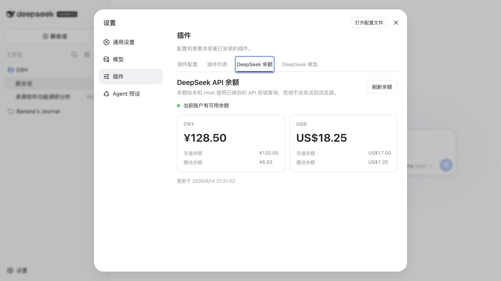
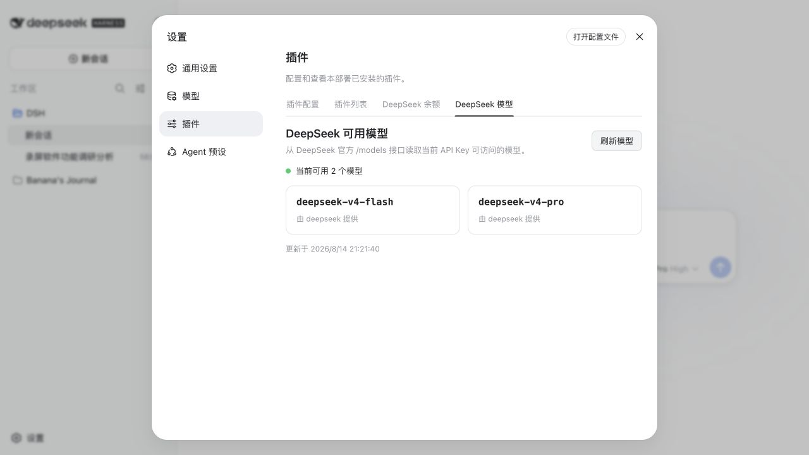

# dsh-balance

在 DeepSeek Harness 的“设置 → 插件”中增加 **DeepSeek 余额**和 **DeepSeek 模型**页签。Host 端使用 Harness 已保存的 `DEEPSEEK_API_KEY` 请求官方 `/user/balance` 与 `/models` 接口，浏览器只接收展示结果，永远不会读取 API Key。





## 快速开始

```bash
dsh plugin --profile web add dsh-balance
dsh --profile web
```

打开 <http://127.0.0.1:3080/>，进入“设置 → 插件 → DeepSeek 余额 / DeepSeek 模型”。如果尚未配置密钥，请先在“设置 → 模型”中保存 DeepSeek API Key，或在启动前设置 `DEEPSEEK_API_KEY`。

## 功能

- 展示账户是否仍可调用 API。
- 分币种展示总余额、充值余额和赠送余额。
- 展示当前 API Key 可访问的全部模型及其所属组织。
- 余额和模型列表分别使用 30 秒 Host 端缓存，并支持手动强制刷新。
- 复用 Harness 凭据服务，支持环境变量和“模型”设置中保存的密钥。
- 默认仅允许从本机打开插件接口；上游默认只允许 HTTPS。
- 缺少密钥、密钥无效、限流、超时和上游异常都有独立提示。

## 开发

要求已安装 DSH，并使用 Node.js 20+ 与 pnpm 11：

```bash
pnpm install
pnpm check
```

项目使用 TypeScript 严格模式、ESLint flat config、Vitest 和 tsdown。`pnpm build` 同时生成 Host ESM 入口、Harness Web client bundle 与类型声明。

## 安装到 DeepSeek Harness

从源码 checkout 构建并安装：

```bash
pnpm install
pnpm build
dsh plugin --profile web add .
dsh --profile web
```

打开 <http://127.0.0.1:3080/>，进入“设置 → 插件 → DeepSeek 余额 / DeepSeek 模型”。如果尚未配置密钥，请先在“设置 → 模型”中保存 DeepSeek API Key，或在启动前设置：

```bash
export DEEPSEEK_API_KEY='sk-...'
```

也可以交付无需安装时构建权限的 tarball：

```bash
pnpm pack:plugin
dsh plugin --profile web add ./dsh-balance-0.2.0.tgz
```

## 配置

默认配置如下，可在更晚加载的 `cordis.patch.yml` 中按 `id: dsh-balance` 覆盖：

```yaml
- id: dsh-balance
  config:
    apiKeyRef: DEEPSEEK_API_KEY
    baseUrl: https://api.deepseek.com
    timeoutMs: 10000
    cacheMs: 30000
    allowRemote: false
```

`baseUrl` 只接受 HTTPS；为了本机集成测试，`127.0.0.1`、`localhost` 和 `::1` 可以使用 HTTP。`allowRemote: false` 会拒绝非 loopback Host 请求。

## 本机 UI 集成测试

仓库包含一个只用于开发的模拟 DeepSeek API 与测试 overlay：

```bash
node scripts/mock-deepseek-api.mjs
DEEPSEEK_API_KEY=dsh-balance-test-key \
  dsh --patch ./tests/cordis.mock.yml --profile web
```

模拟数据应显示人民币 `¥128.50`、美元 `US$18.25`，以及 `deepseek-v4-flash`、`deepseek-v4-pro` 两个模型。

## License

[MIT](./LICENSE)
