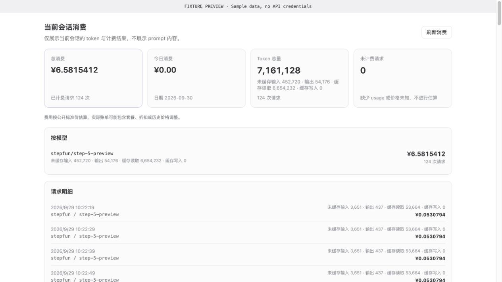

# dsh-balance

[简体中文](./README.md) | [English](./README_EN.md)

DeepSeek Harness 插件，用于查询 DeepSeek / StepFun API 余额、各提供方的可用模型和多维消费统计。API Key 仅由本机 Host 使用，不会发送到浏览器。

界面使用 Harness 原生侧栏、主页面和主题变量。侧栏“插件”下方新增“用量统计”，独立查看所有对话的提供方、模型、会话和日期统计；默认显示全部提供方与全部时间，支持提供方和日期范围筛选。活动打卡图按浏览器时区的星期 × 24 小时汇总请求次数，圆点大小随次数变化；悬停或使用方向键可查看请求数与 token 明细。选择器采用主题化浮层菜单，支持方向键、Home/End、Enter、Escape 和按名称检索。设置页支持 DeepSeek / StepFun 切换。运行 `pnpm preview` 可查看使用示例数据的新版界面。

聊天框底部会跟随当前会话所选的提供方与模型更新余额；设置页可独立切换提供方。

## 功能

- DeepSeek：查看总余额、充值余额和赠送余额
- StepFun：查看可用余额、总充值金额、总赠送金额及预付费 / 后付费账户类型
- 提供方独立缓存；支持大小写不敏感的 Provider ID
- 在聊天框下方显示当前 provider、模型和余额，兼容模型选择器与 `/model` 切换
- 从当前提供方的 `/models` 接口读取可用模型、所属组织与创建时间
- 在设置页按所选 provider、模型、会话和日期查看实际 usage 消费，并在当前会话的“消费”Tab 查看请求明细
- 缺少 provider usage、未知 provider 或未知模型时标记为“未计费”，不进行 token 估算
- 日期按浏览器 IANA 时区分组；DeepSeek 峰谷价格始终按北京时间计算
- DeepSeek 费用显示 USD、StepFun 显示原生 CNY；配置 `usdToCny` 后显示人民币合计
- 缓存查询结果并支持手动刷新
- 依据 DeepSeek 峰谷定价，在高峰时段（北京时间 9:00–12:00、14:00–18:00）将聊天框下方的余额指示灯变为橙色
- 原生支持简体中文和英文，并跟随 Harness 系统语言切换
- 支持 Harness 已保存的 `DEEPSEEK_API_KEY`



## 兼容性

0.10.0 适配 DeepSeek Harness **0.2.0-rc.2**（[上游提交 639ed01](https://github.com/deepseek-ai/deepseek-harness/commit/639ed015397290b3745d163aafe02ffee4aa3f84)），需要 Node.js **22.19+（22.x）或 24+**。本次源码不再兼容 Harness 0.1 的接口。

也可在本地构建并打包源码，再用 `dsh plugin --profile web add /absolute/path/to/package.tgz` 安装生成的 `.tgz` 文件，随后重启 Harness：

```bash
pnpm install --frozen-lockfile
pnpm pack
```

消费统计通过新版只读会话句柄读取，以 `inheritedEventCount` 排除分叉继承的记录；会话页在 token 用量变化或一轮运行结束后刷新；统计页面每 15 秒检查更新，重新聚焦或返回页面时刷新，隐藏页面暂停查询。兼容 `assistant/message` 和重试/取消请求的 `assistant/attempt`，读取最后一条 stream usage，并以重试边界区分独立请求，同一次请求的重复结算仅计一次。

全局统计会跳过当前 dsh 无法读取的旧格式或损坏会话，并显示未纳入统计的会话数量；其余会话仍正常统计。部分读取结果不缓存，下次刷新会重试。单个会话无法读取或所有会话都读取失败时，仍明确显示读取错误，不将失败记录当作零消费。

## 安装

```bash
dsh plugin --profile web add @pinkbanana/dsh-balance@latest
dsh --profile web
```

打开 <http://127.0.0.1:3080/>，进入“设置 → 模型余额”。该入口位于“Agent 预设”下方，余额摘要也会显示在已有会话的聊天框下方。API Key 可在“设置 → 模型”中保存，或通过 `DEEPSEEK_API_KEY` 环境变量提供。

消费统计从已保存会话日志读取，包含当前运行会话已写入的记录，不展示 prompt 内容。可在插件配置中增加固定汇率，例如：

```yaml
usdToCny: 7.2
```

官方提供方 ID `deepseek-official` 与旧 ID `deepseek` 均受支持（大小写不敏感），共享 DeepSeek 凭据、余额及模型缓存。底部保留实际模型 ID，例如 `deepseek-flash`；价格未知的新模型仍标为“未计费”。

## StepFun 配置

在“设置 → 模型”中添加自定义提供方，Provider ID 填写 `StepFun`（`stepfun`、`STEPFUN` 等大小写写法均可），保存 API Key。Harness 默认将其保存为 `STEPFUN_API_KEY`；也可以直接设置该环境变量。在“设置 → 模型余额”选择 StepFun 即可查询。

按 [StepFun 账户 API](https://platform.stepfun.com/docs/zh/api-reference/accounts/get) 使用 Bearer 认证请求 `GET https://api.stepfun.com/v1/accounts`。金额按 CNY 展示；总充值 / 总赠送金额按文档展示为累计金额，不与当前余额相加。接口没有服务可用性字段，后付费账户不会因为余额为零或负数而显示“服务不可用”。

若模型配置使用其他凭据引用，可在本插件配置中覆盖（`baseUrl` 是 API 前缀，StepFun 应包含 `/v1`）：

```yaml
providers:
  - id: StepFun
    apiKeyRef: MY_STEPFUN_KEY
    baseUrl: https://api.stepfun.com/v1
```

已有的顶层 `apiKeyRef` / `baseUrl` 继续用于 DeepSeek；`providers` 覆盖对应提供方的余额与模型查询。配置不读取自定义模型的 Base URL，默认查询官方 API。余额、可用模型与设置页统计随所选提供方切换。聊天框摘要使用当前会话的实时选择；会话“消费”保留该会话历史上所有 provider 的用量。

模型列表按 [StepFun 列表 API](https://platform.stepfun.com/docs/zh/api-reference/models/list) 请求 `GET /v1/models`，解析 [Model 对象](https://platform.stepfun.com/docs/zh/api-reference/models/object) 的 `id`、`owned_by`、`created`（秒级 Unix 时间戳）。列表已包含这些信息，不需要逐个调用单模型详情接口。Host 路由为 `GET /dsh-balance/api/models?provider=StepFun`，模型缓存按 provider 隔离，`refresh=1` 强制刷新。

## 统计口径

每条请求按实际返回消息的 provider / model 归属，兼容旧日志的请求头；日期和峰谷价格按该次请求时间计算。Token 总量包括未缓存输入、输出、缓存读取与缓存写入。设置页默认筛选所选 provider，也可选择“全部提供方”；会话页保留混用模型的完整历史。

内置 DeepSeek 美元定价，以及 2026-09-30 核验的 [StepFun 官方人民币标准价](https://platform.stepfun.com/docs/zh/guides/pricing/details)：`step-5-preview`、`step-3.7-flash`、`step-3.5-flash` 和 `step-3.5-flash-2603`。StepFun 未缓存输入（含缓存写入）、缓存读取、输出分别计价，不套用 DeepSeek 峰谷倍率。费用是公开标准价估算，不代表账户实际账单；套餐、折扣和未保存的历史调价不包含在内。

美元和原生人民币费用分别展示；设置 `usdToCny` 后，人民币合计才会包含美元折算金额。未知 provider / model 和缺失 usage 的请求保留请求数与 token，显示“未计费”；混合统计注明费用不完整。账户余额是实时查询值，与本地用量估算独立。会话消费页采用居中内容宽度、响应式外边距，并为底部输入框保留空间。

## 扩展与设计

- `src/providers.ts` 保存可在前后端共享的 provider 元数据；`src/balance.ts` 的 adapter 表只负责端点与响应解析，传输、错误分类和缓存由公共逻辑处理。
- `GET /dsh-balance/api/balance?provider=StepFun` 查询 StepFun；省略 provider 保持 DeepSeek 兼容，`refresh=1` 绕过对应缓存。不支持的 provider 返回 `UNSUPPORTED_PROVIDER`。
- 通过原生 `sidebar.panellist` 与 `main` 插槽接入侧栏和主页面，菜单、选中态、侧栏折叠和页面导航由 Harness 管理；插件使用 Harness 的颜色、圆角和布局变量，支持深浅色主题与窄屏。

## 开发

```bash
pnpm install
pnpm check
pnpm preview
```

预览不使用真实密钥。可使用 `?page=session` 检查会话消费页（124 次 StepFun 请求、7,161,128 tokens），使用 `?page=usage` 查看独立统计页，使用 `?page=usage&lang=en&theme=dark` 检查英文与深色主题，`?state=missing` / `error` / `empty` / `loading` 检查不同状态。顶部示例模型选择器可验证底部 provider / 模型切换。StepFun 余额与模型查询、新版账户页面自 `0.6.0` 起提供。实时模型余额和统计修复自 `0.7.0` 起提供。

## License

[MIT](./LICENSE)

<a href="https://www.buymeacoffee.com/pinkbanana"></a>
