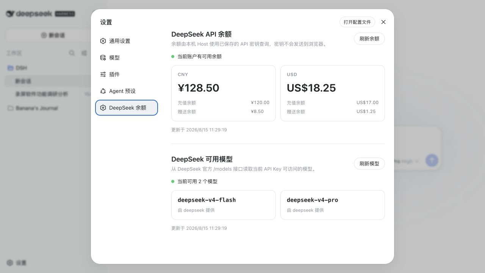
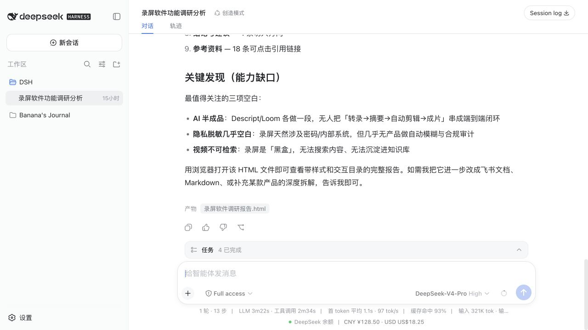

# dsh-balance

[简体中文](./README.md) | [English](./README_EN.md)

A DeepSeek Harness plugin for checking API balances and available models. The API key is used only by the local Host and is never sent to the browser.





## Features

- View total, topped-up, and granted balances
- Keep a compact balance summary below the chat composer
- View models available to the current API key
- Cache query results with manual refresh support
- Native Simplified Chinese and English that follows the Harness system language
- Use the `DEEPSEEK_API_KEY` saved by Harness

## Install

```bash
dsh plugin --profile web add @pinkbanana/dsh-balance
dsh --profile web
```

Open <http://127.0.0.1:3080/> and go to Settings → DeepSeek Balance. The panel sits directly below Agent presets, and the balance summary also appears below the composer in existing sessions. Save the API key in Settings → Models or provide it through the `DEEPSEEK_API_KEY` environment variable.

## Development

```bash
pnpm install
pnpm check
```

## License

[MIT](./LICENSE)

<a href="https://www.buymeacoffee.com/pinkbanana"></a>
