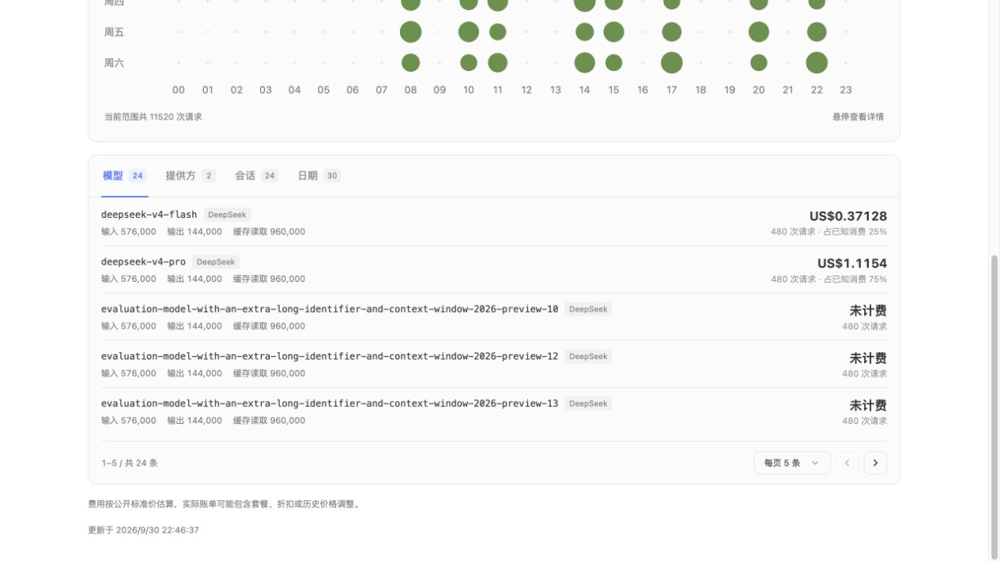

# dsh-balance

[简体中文](./README.md) | [English](./README_EN.md)

A DeepSeek Harness plugin for checking DeepSeek / StepFun API balances, available provider models, and multidimensional usage costs. The API key is used only by the local Host and is never sent to the browser.

The redesigned account ledger switches between DeepSeek and StepFun. Run `pnpm preview` to explore it with sample data.

The composer readout follows the current session’s provider and model. The Settings provider selection is independent.

## Features

- DeepSeek: total, topped-up, and granted balances
- StepFun: available balance, total cash credited, total vouchers granted, and prepaid / postpaid account type
- Independent provider caches and case-insensitive Provider IDs
- Show the current provider, model, and balance below the composer, following both the selector and `/model`
- Fetch available models, owners, and creation dates from the selected provider’s `/models` API
- View actual usage costs by selected provider, model, session, and day in Settings, plus request details in the current session's Usage tab
- Mark missing usage, unknown providers, and unknown models as unpriced without estimating tokens
- Group dates in the browser's IANA timezone while applying DeepSeek peak pricing in Beijing time
- Show native USD and CNY costs separately; `usdToCny` enables a combined CNY total
- Cache query results with manual refresh support
- Follows DeepSeek peak/off-peak pricing: the balance indicator below the composer turns orange during peak hours (09:00–12:00, 14:00–18:00 Beijing time)
- Native Simplified Chinese and English that follows the Harness system language
- Use the `DEEPSEEK_API_KEY` saved by Harness

## Compatibility

Version 0.10.0 targets DeepSeek Harness **0.2.0-rc.2** ([upstream commit 639ed01](https://github.com/deepseek-ai/deepseek-harness/commit/639ed015397290b3745d163aafe02ffee4aa3f84)). Use Node.js **22.19+ (22.x) or 24+**. Harness 0.1 APIs are no longer supported by this checkout.

To install from source, build and pack it locally, then pass the generated `.tgz` path to `dsh plugin --profile web add /absolute/path/to/package.tgz` and restart Harness:

```bash
pnpm install --frozen-lockfile
pnpm pack
```

Usage reads the current read-only session handles and excludes fork-inherited events using `inheritedEventCount`. The conversation tab refreshes when token usage changes or a turn finishes.

Global statistics skip sessions that the current dsh cannot read, such as unsupported historical formats or damaged logs, and show how many sessions were excluded. Partial results are retried on the next refresh without caching. An unreadable selected session, or a collection where every session fails to read, still reports an error instead of showing zero usage.

Usage breakdowns use counted tabs for models, providers, sessions, and dates, with a themed category selector on narrow screens. Lists default to 10 rows per page, with 5 / 10 / 20 options. The conversation page separates model summaries and requests, and requests can be filtered by model. Long names are truncated with their full value available on hover.



## Install

```bash
dsh plugin --profile web add @pinkbanana/dsh-balance@latest
dsh --profile web
```

Open <http://127.0.0.1:3080/> and go to Settings → Model Balances. The panel sits directly below Agent presets, and the balance summary also appears below the composer in existing sessions. Save the API key in Settings → Models or provide it through the `DEEPSEEK_API_KEY` environment variable.

Usage statistics read persisted session logs, including writes visible from active sessions. Prompt content is never exposed. To show a fixed-rate CNY conversion, add for example:

```yaml
usdToCny: 7.2
```

Both the official provider ID `deepseek-official` and legacy `deepseek` are supported case-insensitively and share DeepSeek credentials, balance caches, and model caches. The composer retains the actual model ID, such as `deepseek-flash`; new models with unknown pricing remain unpriced.

## StepFun setup

Add a custom provider in Settings → Models with Provider ID `StepFun` (`stepfun`, `STEPFUN`, and other case variants work) and save its API key. Harness derives the credential reference `STEPFUN_API_KEY`; setting that environment variable also works. Select StepFun in Settings → Model Balances.

The [StepFun account API](https://platform.stepfun.com/docs/zh/api-reference/accounts/get) uses Bearer authentication at `GET https://api.stepfun.com/v1/accounts`. Amounts are shown in CNY. Cash and voucher totals are cumulative amounts as documented, not remaining balance components. The API does not report service availability, so a zero or negative postpaid balance is not labeled as unavailable service.

To use another credential reference, override the balance provider in this plugin's configuration (`baseUrl` is an API prefix; include `/v1` for StepFun):

```yaml
providers:
  - id: StepFun
    apiKeyRef: MY_STEPFUN_KEY
    baseUrl: https://api.stepfun.com/v1
```

Existing top-level `apiKeyRef` / `baseUrl` settings continue to serve DeepSeek. The `providers` entries override both balance and model queries. Custom model base URLs are not read automatically; balance queries default to official APIs. Balances, models, and Settings usage follow the selected provider. The composer follows the live session selection; the session Usage tab preserves historical usage across all providers.

Model lists use the [StepFun list API](https://platform.stepfun.com/docs/zh/api-reference/models/list) at `GET /v1/models`, parsing `id`, `owned_by`, and `created` (Unix seconds) from each [Model object](https://platform.stepfun.com/docs/zh/api-reference/models/object). These fields are already returned in the list, so individual model retrieval is unnecessary. The Host route is `GET /dsh-balance/api/models?provider=StepFun`, with isolated provider caches and `refresh=1` to force a refresh.

## Usage accounting

Each request is attributed to its actual message source, with request headers as a fallback for older logs. Request time determines date grouping and peak pricing. Token totals include uncached input, output, cache reads, and cache writes. Settings defaults to the selected provider, with an All providers option; the session view keeps mixed-provider history.

Built-in estimates cover official DeepSeek USD rates and verified StepFun mainland CNY reference rates. Requests without supported pricing keep their token and request counts and show as unpriced. A similarly named DeepSeek model does not inherit official DeepSeek pricing on another provider. Entirely unpriced totals do not show $0; mixed totals include only known charges and carry a partial-cost label. Live account balances are separate from local usage estimates.

## Extension and design

- `src/providers.ts` holds shared provider metadata. The adapter table in `src/balance.ts` defines endpoints and response parsers; transport, errors, and caching are shared.
- `GET /dsh-balance/api/balance?provider=StepFun` selects StepFun. Omitting provider preserves DeepSeek compatibility; `refresh=1` bypasses that provider's cache. Unknown providers return `UNSUPPORTED_PROVIDER`.
- The layout draws on [Codrops' Kononenko case study](https://tympanus.net/codrops/2026/09/18/kononenko-architectural-bureau/): oversized type, negative space, architectural grids, and geometric linework, implemented in original CSS with light/dark themes, narrow layouts, and reduced-motion support.

## Development

```bash
pnpm install
pnpm check
pnpm preview
```

The preview uses no real credentials. Use `?lang=en&theme=dark` for English/dark mode, or `?state=missing`, `error`, `empty`, or `loading` to inspect those states. The sample model selector also exercises the composer readout. StepFun balance and model queries and the redesigned account page are available starting with `0.6.0`. Live model balances, and usage accounting fixes are available starting with `0.7.0`.

## License

[MIT](./LICENSE)

<a href="https://www.buymeacoffee.com/pinkbanana"></a>

## Native usage page

A **Usage Statistics** entry below **Plugins** in the native sidebar opens a standalone page. It defaults to all providers and all time, with provider/date-range filters and breakdowns by provider, model, session, and day. Native `sidebar.panellist` and `main` slots keep navigation, collapsed sidebar behavior, and active styling consistent with Harness. Plugin surfaces use Harness theme colors and radii.

Usage includes completed messages and failed, retried, or cancelled attempts with a reported stream usage sample. The final sample wins within an attempt; retry boundaries count separate calls. Inherited fork events are excluded. Open statistics refresh every 15 seconds and on focus/visibility return, without polling hidden pages. Manual refresh also populates the normal revision cache. Unknown prices remain unpriced.

Run `pnpm preview` and open `?page=usage` (or `?page=usage&lang=en&theme=dark`) to inspect the fixture page.

The activity punchcard groups requests by weekday and hour in the selected browser timezone. Dot area tracks request counts and follows provider/date filters, including DST repeated hours. Hover or use arrow keys for request/token details. Filters use themed, portaled listboxes with keyboard navigation, selection checks, Escape/outside-click dismissal, and typeahead.

### v0.10.0 usage accounting

The conversation usage view has centered content, responsive padding and space for the composer. Cache input is counted once; duplicate settlements replace the previous sample, retries remain separate, and fork prefixes are excluded.

StepFun mainland API estimates use [official standard CNY rates](https://platform.stepfun.com/docs/zh/guides/pricing/details), verified on 2026-09-30, for `step-5-preview`, `step-3.7-flash`, `step-3.5-flash` and `step-3.5-flash-2603`. These reference estimates do not account for plans, discounts or unrecorded historical rate changes. USD and native CNY are shown separately; only an explicitly configured `usdToCny` rate enables a combined CNY total. Unknown rates remain unpriced. `?page=session` previews the conversation view with 124 StepFun requests.
